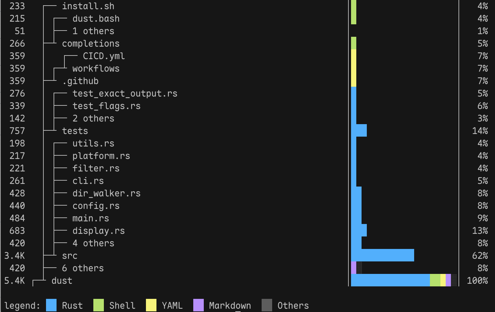

# clocst

> Like [dust](https://github.com/bootandy/dust) for disk space, but for **lines of code**.

`clocst` visualizes code distribution across a project as a directory tree, showing each folder and file's share of total lines with colored progress bars — language-colored, terminal-aware, and fast.



---

**Note:** `clocst` is not a replacement for [cloc](https://github.com/AlDanial/cloc). It currently counts only non-empty, non-comment lines and does not report blank line or comment statistics. If you need those breakdowns, use `cloc` directly.

---

## Installation

```bash
cargo install --path .
```

## Usage

```bash
clocst [PATH] [OPTIONS]
```

`PATH` defaults to the current directory.

| Option | Description | Default |
|--------|-------------|---------|
| `--top N` | Number of languages to highlight with color | `4` |
| `--depth D` | Maximum directory depth to expand | unlimited (auto-pruned by terminal height) |
| `--no-ignore` | Disable `.gitignore` / `.ignore` filtering | — |
| `--colors c1,c2,...` | Custom color list | `blue,green,yellow,magenta` |

## Example

```
$ clocst ~/myproject

 12.4K   myproject            │████████████████████│ 100%
  8.1K   ├── src              │█████████████░░░░░░░│  65%
  4.2K   │   ├── main.rs      │████████░░░░░░░░░░░░│  34%
  3.9K   │   └── lib.rs       │███████░░░░░░░░░░░░░│  31%
  4.3K   └── tests            │████████░░░░░░░░░░░░│  35%

Rust 12.4K ████████████████████ 100%
```

The colored `█` segments represent languages within the `--top` range; `░` fills the rest.

## How It Works

Three-stage pipeline:

1. **Scanner** — parallel directory traversal via `rayon` + `ignore`, respects `.gitignore` by default
2. **TreeBuilder** — aggregates per-language line counts up the directory hierarchy
3. **Renderer** — formats the tree with color bars scaled to terminal width, auto-pruning deep trees to fit the screen

## Limitations

- Counts code lines only; blank lines and comment lines are not tracked separately
- Language detection is extension-based; polyglot files and shebangs are not handled
- Not a drop-in replacement for `cloc` — use `cloc` when you need full statistics
